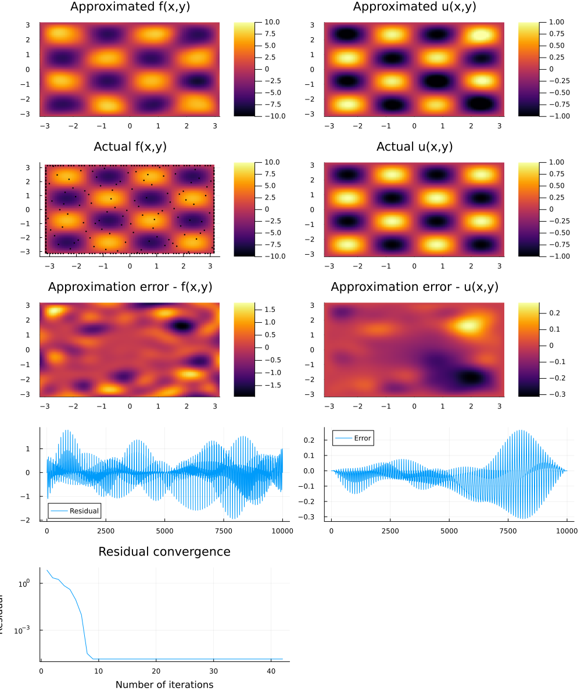

### Main research questions

1. Do operator adapted derivative features improve the accuracy of simulations compared to an RBF representation?
2. Does preconditioning help when solving non-linear problems?

It turns out that derivative representers improve the accuracy of approximations by an order of magnitude. 

Furthermore, preconditiong with a whitenting transform and the Gamblets transform are ridiculously more efficient than optimization in the canonical bases. 

